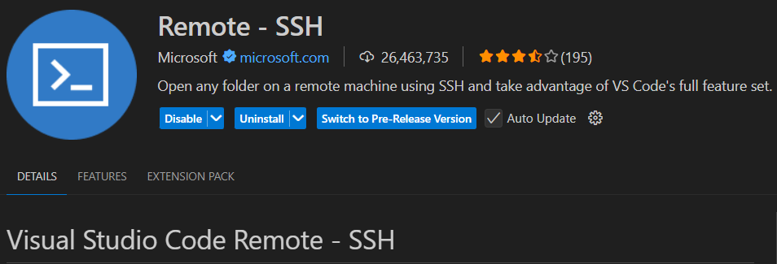
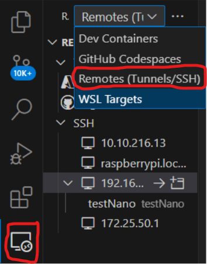
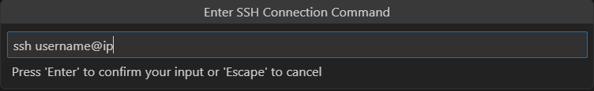
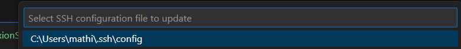
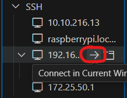
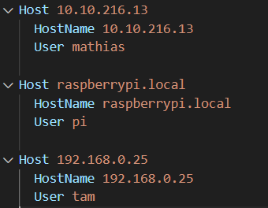

# SSH VsCode

## Objectifs

* Coder sur son Raspberry Pi depuis son pc
* Injecter directement du code depuis son pc dans son Raspberry Pi

## Tutoriel

## Raspberry

Autoriser SSH

## PC

## Se connecter en SSH

1. Installer Remote - SSH de Microsoft
2. Aller dans Remote Explorer
3. Ajouter dans l'onglet SSH user@ip de son RPi et son mot de passe

## Installation détaillée

1. Installer **Remote - SSH** de Microsoft  
  

1. Aller dans **Remote - Explorer** et choisir **Remotes(Tunnels/SSH)**  
  

1. Cliquer sur **+** dans l'onglet **SSH**  
  

1. Mettre le **username@ip** du RPi  
  

1. Choisir le **fichier de configuration SSH**, le premier est bon  
  

1. Se **connecter** à l'**hôte**  
  

1. Il faut **choisir** entre **Linux**, MacOS et Windows, ici **Linux** car le Rpi est sous Raspbian  

Si il y a un problème, on peut accéder au fichier de config du Rpi:  
Cliquer sur l' **icône paramètres** de l'onglet **SSH** dans **Remote Explorer**
  

Puis on accède au **fichier de configuration** et on peut le **modifier**, par exemple: **supprimer** un hôte si on en a plus besoin ou si on a un problème avec  
  

## Changer de port

Si le port SSH n'est pas le port 22:

* Aller dans les paramètres de SSH dans "Remote Explorer" -> SSH -> SSH Config File
* Mettre la ligne "Port [numéro du port]"
